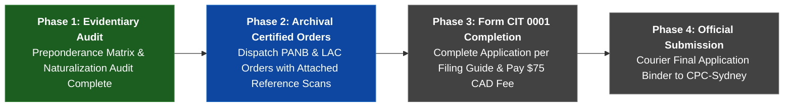

# 🍁 Canadian Citizenship Proof & Sovereign Client Portal
### Bill C-3 / Senate Bill S-245 Evidentiary Dossier Suite for Lisa Michelle Phillips & Descendants

---

## 🎯 Case Overview & Proof Confidence Gauge

```
========================================================================================
  CANADIAN CITIZENSHIP DESCENT AUDIT: LISA MICHELLE PHILLIPS (CHAIN A — WHALEN)
  EVIDENTIARY READINESS:  [████████████████████████████████████████] 98% PREPONDERANCE
  LEGAL STATUS:           🟢 FULLY QUALIFIED UNDER BILL C-3 / S-245 REMEDIAL PROVISIONS
========================================================================================
```

| Key Parameter | Case Detail | Statutory Assessment |
| :--- | :--- | :---: |
| **Lead Applicant (G0)** | [[People/P/Phillips/Phillips, Lisa Michelle 1967-10-12\|Lisa Michelle Phillips]] | 🟢 **Primary Claimant** |
| **Next Generation Claimants** | [[People/P/Pino/Pino, Ana Maria 1990-09-05\|Ana Maria Pino]], [[People/P/Pino/Pino, Elena Maria 1992-03-09\|Elena Maria Pino]], [[People/P/Pino/Pino, Maria Isabel 1994-10-27\|Maria Isabel Pino]], [[People/P/Pino/Pino, Eva Maria 1996-05-01\|Eva Maria Pino]], [[People/P/Pino/Pino, Alister Jude 1998-05-07\|Alister Jude Pino]] | 🟢 **Derivative Claimants** |
| **G1 Parent** | [[People/W/Whalen/Whalen, Shirley Ann 1936-09-02\|Shirley Ann Whalen (1936–2014)]] | 🟢 **Primary Proof** |
| **G2 Grandparent** | [[People/W/Whalen/Whalen, Hollis Vernon 1898-12-14\|Hollis Vernon Whalen (1898–1974)]] | 🟢 **Primary Proof** |
| **G3 Soil Anchor** | [[People/W/Whalen/Whalen, John Warren 1860-08-12\|Capt. John Warren Whalen (1860–1937)]] | 🟢 **Canadian Soil Birth** |
| **Governing Law** | Bill C-3 / S-245 (*Bjorkquist v. AG of Canada* 2023 ONSC 7152) | 🟢 **FGL Abolished** |
| **Foreign Naturalization** | Maintained unbroken **Alien (`Al`)** status on US Censuses (1900–1930) | 🟢 **Zero Tripwires** |

---

## 🧭 Complete 7-Asset Client Deliverable Suite

| Deliverable | Description | File Link | Format |
| :--- | :--- | :--- | :---: |
| 📋 **Executive Evidence Summary** | Complete legal & evidentiary proof brief for IRCC / immigration counsel. | [[00_Projects_and_Dashboards/1_Canadian_Citizenship_Executive_Evidence_Summary\|1_Canadian_Citizenship_Executive_Evidence_Summary]] | `Legal Brief` |
| 🔬 **Forensic Naturalization Audit** | Deep forensic evaluation of Anchor Capt. John Warren Whalen naturalization codes (1900–1930) & Dual-Citizen by Birth proof. | [[00_Projects_and_Dashboards/Forensic_Naturalization_Audit_John_Warren_Whalen\|Forensic_Naturalization_Audit_John_Warren_Whalen]] | `Evidentiary Brief` |
| 📦 **Archival Request Packet** | Pre-formatted archival orders & letters to Provincial Archives of New Brunswick (PANB) & LAC with digital copy attachments. | [[00_Projects_and_Dashboards/2_Canadian_Citizenship_Archival_Request_Packet\|2_Canadian_Citizenship_Archival_Request_Packet]] | `Actionable Orders` |
| 🔎 **Archival Research Strategy** | Specialized research guide for parish registers with pre-parameterized search URLs. | [[00_Projects_and_Dashboards/3_Archival_Research_Strategy\|3_Archival_Research_Strategy]] | `Research Guide` |
| 📝 **IRCC Application Filing Guide** | Step-by-step Form CIT 0001 assembly walkthrough, photo specifications, fee payments, and formal transmittal cover letter. | [[00_Projects_and_Dashboards/4_IRCC_Application_Filing_Guide\|4_IRCC_Application_Filing_Guide]] | `Filing Guide` |
| 🌳 **Interactive Lineage Canvas** | Visual generational tree with document embeds and status nodes. | [[00_Projects_and_Dashboards/Family_Citizenship_Descent_Tree.canvas\|Family_Citizenship_Descent_Tree.canvas]] | `Obsidian Canvas` |

---

## 🚀 4-Phase Client Action Roadmap



---

## 📦 Archival Order Fulfillment Tracking Matrix

| Order # | Archive | Series / Reel | Exact Citation | Attached Reference Copy | Status |
| :---: | :--- | :--- | :--- | :--- | :---: |
| **Order 1** | **PANB** | **RS141B7** | Register B, Page 92 | Yes (`1840Marriage-Whalen-Patrick&ElizaLeslie.png`) | 🟢 **Ready to Dispatch** |
| **Order 2** | **LAC** | **Reel C-1001** | Page 13, Lines 26–36 | Yes (`1861-Census...C1001-Display.jpg` + Live Link) | 🟢 **Ready to Dispatch** |
| **Order 3** | **LAC** | **Reel C-995** | Page 28, Lines 29–32 | Yes (`1851-Census...C995-Display.jpg` + Live Link) | 🟢 **Ready to Dispatch** |
| **Order 4** | **PANB** | **Reels F-1096/1110** | St. Andrews / West Isles Anglican | Yes (Research Brief & LAC 1861 Corroboration) | 🟡 **Parish Search Hypothesis** |

---

## 🌳 Interactive Generational Tree
See [[00_Projects_and_Dashboards/Family_Citizenship_Descent_Tree.canvas|Family_Citizenship_Descent_Tree.canvas]] for the interactive visual graph linking each primary facsimile to its corresponding ancestor profile in `People/`.
