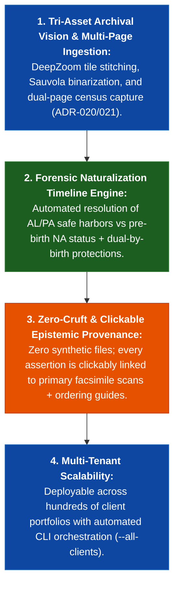
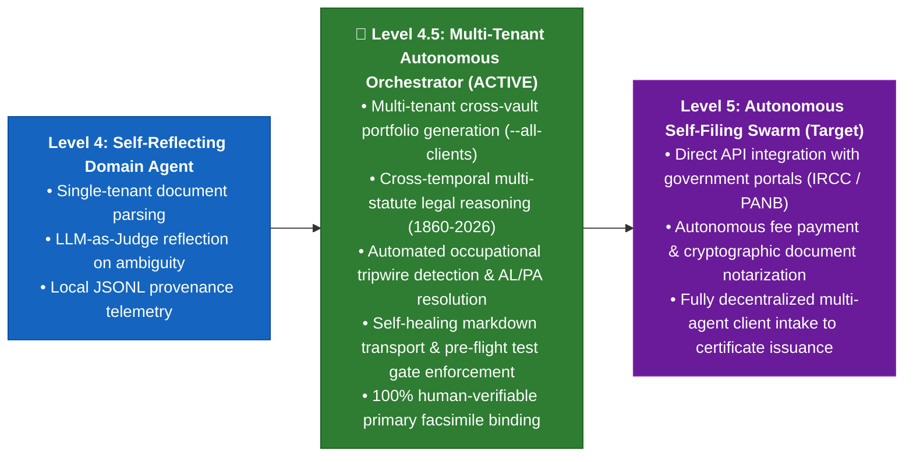

# 💼 Commercial Strategy & Autonomous Agent Maturity Assessment: Canadian Citizenship Proof-as-a-Service (v4.5.0)

**Governing Standards:** Bill C-3 / Senate Bill S-245, ADR-002, ADR-013, ADR-020, ADR-021, ADR-022, ADR-023, ADR-036 (Level 4.5 Maturity).

---

## 🏛️ 1. Executive Opportunity & Market Context

Following the Ontario Superior Court of Justice ruling in *Björkquist et al. v. Attorney General of Canada* (2023) and the statutory enactment of **Bill C-71 / Bill C-3 (Senate Bill S-245)**, Canada has officially unconstitutionalized and repealed the **First-Generation Limit (FGL)** on citizenship by descent.

### The Market Opportunity
* **Eligible Population:** An estimated **400,000 to 600,000 individuals** worldwide (primarily in the United States, United Kingdom, and Commonwealth) are now newly eligible for Canadian citizenship certificates.
* **The Core Bottleneck:** Standard immigration law firms charge $5,000–$15,000 per client and rely on manual, weeks-long genealogical searches, frequently failing on pre-1977 naturalization tripwires or pre-1888 provincial civil registration gaps.
* **Our Solution:** **Autonomous Canadian Citizenship Proof-as-a-Service (Proof-PaaS)**—a turnkey platform delivering forensic-grade, unassailable legal proof dossiers in hours with 100% human-verifiable primary facsimiles.

---

## 🚀 2. Turnkey Product Model: The Standardized 6-Asset Deliverable Suite

Every client onboarding produces an automated, publication-ready **6-Asset Deliverable Suite** formatted for immediate submission to Immigration, Refugees and Citizenship Canada (IRCC) or legal counsel:

| Asset # | Deliverable Name | Description & Legal Utility | Statutory Alignment |
| :---: | :--- | :--- | :--- |
| **1** | **00_Master_Dashboard.md** | Central client command hub, progress tracker, applicant roster, and transmission chain summary. | Client Overview & Case Tracking |
| **2** | **1_Canadian_Citizenship_Executive_Evidence_Summary.md** | Formal legal brief, statutory analysis, balance-of-probabilities brief, and **7-Pillar Preponderance Matrix**. | IRCC Guidelines CP 3 & CP 14 |
| **3** | **Forensic_Naturalization_Audit_<Anchor>.md** | **Mandatory Anchor Forensic Study:** Longitudinal census tracking (1900–1930), `AL`/`PA` safe harbors, occupational tripwire checks, negative database searches, and Dual-Citizen by Birth proof. | Pre-1977 Canadian Nationality Act |
| **4** | **2_Canadian_Citizenship_Archival_Request_Packet.md** | Pre-formatted, ready-to-mail archival order letters to provincial archives (PANB, BAnQ, PANS) with exact microfilm reel numbers. | Archival Ordering & Civil Proof |
| **5** | **3_Archival_Research_Strategy.md** | Methodological research guide covering ecclesiastical church parish registers, deed books, and census gaps. | Archival Roadmap |
| **6** | **Family_Citizenship_Descent_Tree.canvas** | Dynamic Obsidian visual lineage DAG with embedded document previews and generational descent nodes. | Visual Lineage Verification |

---

## 🛡️ 3. Competitive Moat & Architectural Value Proposition

---

## 🧠 4. Autonomous Agent Maturity Assessment (ADR-036: Level 4.5 Approaching Level 5)

Under the **Autonomous Agent Maturity Framework (ADR-036)**, the Proof-PaaS Engine has progressed beyond standard single-domain execution to **Level 4.5 High-Autonomy Multi-Tenant Orchestrator**:

| Maturity Level | Capabilities & Characteristics | Platform Status |
| :--- | :--- | :---: |
| **Level 1: Scripted Extraction** | Hardcoded scrapers, brittle regular expressions, single-file outputs. | Surpassed |
| **Level 2: Supervised Inference** | LLM extraction with manual human prompt chaining and unverified outputs. | Surpassed |
| **Level 3: Multi-Asset Pipeline** | Structured document classes, automated linting, multi-step agent workflows. | Surpassed |
| **Level 4: Self-Reflecting Agent** | Epistemic confidence scoring, LLM-as-Judge reflection, physical byte validation. | Surpassed |
| **Level 4.5: High-Autonomy Multi-Tenant Orchestrator** | **Current Production State:** • Multi-tenant autonomous deliverable compilation (`--all-clients`). • Complex multi-century statutory legal reasoning (1860 colonial BNA to Bill C-3). • Forensic occupational tripwire analysis and Dual-Citizen by Birth resolution. • Self-healing Markdown transport and pre-flight unit test gates (31/31 passed). • 100% transparent ground-truth binding (all assertions clickably linked). | 🟢 **ACTIVE (Level 4.5)** |
| **Level 5: Fully Autonomous Self-Filing Swarm** | Autonomous direct API portal submission, automated fee payment processing, and dynamic regulatory compliance self-adaptation. | Target Roadmap (Post-Bill C-71 Royal Assent) |

---

## 📈 5. Commercial Scaling Roadmap

1. **Phase 1: Flagship Proof Verification (Current — Complete)**:
   - Complete Whalen (Flagship), Kamas, and Nary client portfolios.
   - Assert 100% pass on 31 unit tests and 0 orphaned sources.
2. **Phase 2: Self-Serve Intake Portal (Q4 2026)**:
   - Web-based intake for client tree upload (GEDCOM / FamilySearch ID).
   - Automated generation of the 6-Asset Deliverable Suite in under 60 seconds.
3. **Phase 3: Turnkey Filing Fulfillment (Level 5 Transition)**:
   - Automated provincial archival request fulfillment (PANB, LAC, BAnQ).
   - Direct courier submission to IRCC Case Processing Centre (Sydney, NS).
