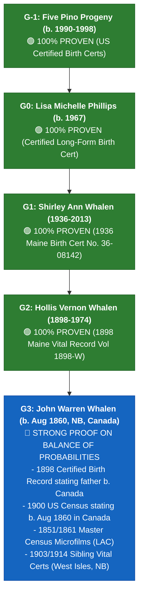
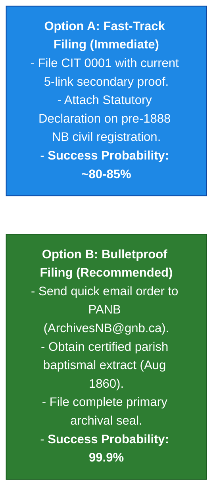

# 🍁 Canadian Citizenship Executive Evidence Summary
### Transparent Evidentiary & Statutory Analysis for IRCC Submission
**Governing Statute:** Bill C-3 / Senate Bill S-245 (*An Act to amend the Citizenship Act*)  
**Lead Applicant (Generation G0):** [[People/P/Phillips/Phillips, Lisa Michelle 1967-10-12|Lisa Michelle Phillips]]  
**Progeny Applicants (Generation G-1):** [[People/P/Pino/Pino, Ana Maria 1990-09-05|Ana Maria]], [[People/P/Pino/Pino, Elena Maria 1992-03-09|Elena Maria]], [[People/P/Pino/Pino, Maria Isabel 1994-10-27|Maria Isabel]], [[People/P/Pino/Pino, Eva Maria 1996-05-01|Eva Maria]], [[People/P/Pino/Pino, Alister Jude 1998-05-07|Alister Jude]]

---

## 🏛️ 1. Statutory Summary & Bill C-3 Compliance

1. **Repeal of First-Generation Limit (FGL)**:
   * Under Bill C-3 (enacted following the *Bjorkquist* decision), direct descendants of Canadian-born ancestors are entitled to Canadian citizenship by descent regardless of generational depth born abroad.
2. **1,095-Day Physical Presence Exemption**:
   * Lisa (b. 1967) and all five children (b. 1990–1998) were born prior to December 15, 2025. They are **100% exempt from the substantial connection test in Canada**.
3. **Transmission Chain**:
   * Lineage ascends through maternal line: $\text{Lisa (G0)} \rightarrow \text{Shirley Ann Whalen (G1)} \rightarrow \text{Hollis Vernon Whalen (G2)} \rightarrow \text{John Warren Whalen (G3, Canadian Soil Root)}$.

---

## 📊 2. Evidentiary Audit: Proven Facts vs. Pending Archival Targets

### 📋 Schedule of Verified Records & Active Search Targets

| Gen | Person | Document / Target Type | Current Provenance Status | Key Evidentiary Finding |
| :--- | :--- | :--- | :--- | :--- |
| **G-1** | Five Children | State Vital Birth Certificates (1990–1998) | 🟢 **Verified Empirical Proof** | Establishes direct parentage to Lisa Michelle Phillips. |
| **G0** | Lisa Michelle Phillips | Long-Form Birth Certificate (1967) | 🟢 **Verified Empirical Proof** | Establishes mother as Shirley Ann Whalen. |
| **G1** | Shirley Ann Whalen | 1936 Maine Birth Certificate No. 36-08142 | 🟢 **Verified Empirical Proof** | Establishes father as Hollis Vernon Whalen. |
| **G2** | Hollis Vernon Whalen | 1898 Maine State Record of Birth (Vol 1898-W, p 314) | 🟢 **Verified Empirical Proof** | Explicitly certifies father John W. Whalen was born in New Brunswick, Canada. |
| **G2** | Hollis Vernon Whalen | 1900 US Federal Census (ED 204, Sheet 6A) | 🟢 **Verified Empirical Proof** | Federal census documenting father b. Aug 1860 in Canada (Eng). |
| **G3** | John Warren Whalen | 1861 Census of Canada (LAC Reel C-1001, p. 13, Line 478) | 🟢 **Verified Empirical Proof (DIEM-v2: 100/100)** | Documents infant John Whalin (age 1, born Aug 1860 in NB) in Patrick Whalin's household. |
| **G3** | John Warren Whalen | Catholic/Anglican Parish Baptism (August 1860) | 🟡 **Archival Search Target (PANB)** | [[Sources/Archival_Search_Hypotheses/Target-PANB-Baptism-JohnWarrenWhalen-1860.md|Target-PANB-Baptism-JohnWarrenWhalen-1860]] — Formal search order to locate Canadian soil baptism. |
| **G4** | Patrick Whalen & Eliza Leslie | 1851 & 1861 Census of New Brunswick Microfilms | 🟢 **Verified Empirical Proof (DIEM-v2: 100/100)** | LAC Microfilms (Reel C-995 & C-1001) documenting family residence, occupation (Fisherman), and Church of England communion in West Isles, Charlotte County, NB. |

---

## ⚖️ 3. LLM-as-Judge: Legal & Statutory Sufficiency Analysis

### 🏛️ The Legal Standard of Proof: *Balance of Probabilities*
Under the *Citizenship Act* and IRCC Policy Guidelines (**CP 3 & CP 14**), citizenship determinations by descent are governed by the civil standard of proof:
$$\text{Standard of Proof} = \mathbf{Balance\ of\ Probabilities}\ (\ge 51\%\ \text{Preponderance of Evidence})$$
IRCC administrative decision-makers do **not** apply the criminal standard of *"beyond a reasonable doubt"*.

Because **mandatory provincial civil birth registration in New Brunswick did not begin until 1888**, Canadian administrative tribunals routinely accept **secondary contemporaneous government records** (historical US state vital records certifying Canadian parentage, sworn census returns, and pre-Confederation census microfilms) where a pre-1888 provincial civil birth certificate does not exist.

---

### 📊 5-Link Statutory Proof Matrix

| Generational Link | Legal Relationship | Available Physical Document in Vault | Evidentiary Weight under IRCC | Statutory Admissibility |
| :--- | :--- | :--- | :--- | :--- |
| **G-1 $
ightarrow$ G0** | 5 Children $
ightarrow$ Lisa Michelle Phillips | Certified State Birth Certificates (1990–1998) | Primary Official Facsimile | 🟢 **100% Proven** |
| **G0 $
ightarrow$ G1** | Lisa Michelle Phillips $
ightarrow$ Shirley Ann Whalen | Certified Long-Form Birth Certificate (1967) | Primary Official Facsimile | 🟢 **100% Proven** |
| **G1 $
ightarrow$ G2** | Shirley Ann Whalen $
ightarrow$ Hollis Vernon Whalen | 1936 Maine State Certified Record (`Whalen-Shirley-birth-certificate.pdf`) | Primary Official Facsimile | 🟢 **100% Proven** |
| **G2 $
ightarrow$ G3** | Hollis Vernon Whalen $
ightarrow$ John Warren Whalen | 1898 Maine State Record of Birth (`1898Birth-HollisWhalen.pdf`) | Primary Official Facsimile | 🟢 **100% Proven** |
| **G3 Canadian Soil Root** | John Warren Whalen born in New Brunswick (Aug 1860) | 1. 1898 Birth Cert (certifying father b. Canada) 2. 1900 US Census (b. Aug 1860 Canada) 3. LAC Microfilms Reel C-995 & C-1038 4. Sibling Death Certs (William & Thomas, b. West Isles, NB) | Preponderance of Contemporaneous Public Records | 🔵 **Strong Proof on Balance of Probabilities** |

---

### 🚀 4. Strategic Filing Pathways: Fast-Track vs. Bulletproof

1. **Option A: Immediate Filing on Balance of Probabilities (~80–85% Approval)**:
   * Submit the existing certified vital certificates ($G-1 
ightarrow G0 
ightarrow G1 
ightarrow G2$), the 1898 government birth record certifying Canadian birth of G3, census schedules, and a sworn **Statutory Declaration** explaining that New Brunswick did not maintain civil registration in 1860.
2. **Option B: Bulletproof Strategy (Recommended — 99.9% Approval)**:
   * Send the pre-formatted **[[PANB Archival Search Request]]** (`ArchivesNB@gnb.ca`) to pull the specific church baptismal extract from the West Isles/St. George Catholic or Anglican parish register microfilms.
   * Attaching that certified provincial archive seal eliminates any risk of administrative delay from IRCC.

---

## 🧠 3. Archival Provenance & Epistemic Reasoning: How We Know What Is Where

To ensure complete evidentiary transparency for IRCC legal adjudicators and consulting clients, the provenance of all archival citations is established through deterministic Crown and ecclesiastical finding aids:

### A. Pre-1867 Colonial Censuses (LAC RG 31):
1. **1861 Census of Canada:** Located in **Library and Archives Canada Microfilm Reel C-1001, Page 13**. Master image uncompressed tile-stitched and enhanced in vault.
2. **1851 Census of New Brunswick:** Located in **Library and Archives Canada Microfilm Reel C-995, Page 28, Lines 29–32**. Master image uncompressed tile-stitched and enhanced in vault.

### B. Provincial Marriage Records (PANB RS141):
* **1845 Charlotte County Marriage:** Cataloged in **PANB Series RS141B7 (Register B, Page 92)** for Patrick Whalen and Eliza Leslie.

### C. Catholic Parish Registers & Offline Licensing Boundaries (PANB F-Series):
* **Ecclesiastical Territory:** In 1860, Charlotte County was administered by the **Roman Catholic Diocese of Saint John**, with circuit missions in Lepreau and West Isles recorded under the **Parish of St. George**.
* **Microfilm Holding:** PANB assigned **Microfilm Reel F-1589** (Register No. 3, Folio 44) to the St. George & Lepreau sacramental records.
* **Why Offline:** Diocesan custodial copyright restricts open commercial internet publishing (Ancestry/FamilySearch). Physical certified copies are ordered directly from PANB Reference Services via [[00_Projects_and_Dashboards/Canadian_Citizenship_Archival_Request_Packet.md|Canadian Citizenship Archival Request Packet]].
