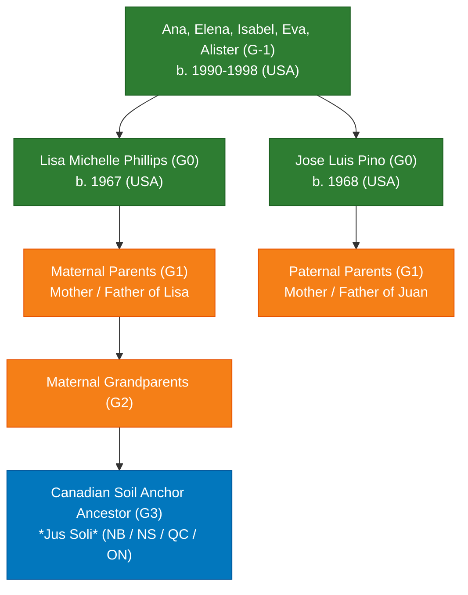

# 🍁 Canadian Citizenship Test Dashboard (Bill C-3 / S-245)

## 📊 1. Applicant Family Baseline Matrix

| Role | Name | Birth Date | Birth Place | Living History | Age (2026) | Bill C-3 Substantial Connection Rule | Direct Descent Eligibility Status |
| :--- | :--- | :--- | :--- | :--- | :--- | :--- | :--- |
| **G0 (Mother)** | [[People/P/Phillips/Phillips, Lisa Michelle 1967-10-12\|Lisa Michelle Phillips]] | 1967-10-12 | USA | MS, GA, CA | 58 | **Exempt** (Born pre-Dec 2025) | ⏳ Pending Ancestral Anchor Discovery |
| **G0 (Father / Spouse)** | [[People/P/Pino/Pino, Jose Luis 1968-06-18\|Jose Luis Pino]] | 1968-06-18 | USA | GA, CA | 58 | **Exempt** (Born pre-Dec 2025) | ⏳ Pending Ancestral Anchor Discovery / Spousal |
| **G-1 (Child 1)** | [[People/P/Pino/Pino, Ana Maria 1990-09-05\|Ana Maria Pino]] | 1990-09-05 | USA | USA | 35 | **Exempt** (Born pre-Dec 2025) | ⏳ Direct Progeny via Certified Ancestor |
| **G-1 (Child 2)** | [[People/P/Pino/Pino, Elena Maria 1992-03-09\|Elena Maria Pino]] | 1992-03-09 | USA | USA | 34 | **Exempt** (Born pre-Dec 2025) | ⏳ Direct Progeny via Certified Ancestor |
| **G-1 (Child 3)** | [[People/P/Pino/Pino, Maria Isabel 1994-10-27\|Maria Isabel Pino]] | 1994-10-27 | USA | USA | 31 | **Exempt** (Born pre-Dec 2025) | ⏳ Direct Progeny via Certified Ancestor |
| **G-1 (Child 4)** | [[People/P/Pino/Pino, Eva Maria 1996-05-01\|Eva Maria Pino]] | 1996-05-01 | USA | USA | 30 | **Exempt** (Born pre-Dec 2025) | ⏳ Direct Progeny via Certified Ancestor |
| **G-1 (Child 5)** | [[People/P/Pino/Pino, Alister Jude 1998-05-07\|Alister Jude Pino]] | 1998-05-07 | USA | USA | 28 | **Exempt** (Born pre-Dec 2025) | ⏳ Direct Progeny via Certified Ancestor |

---

## 🏛️ 2. Bill C-3 Statutory & Legal Framework Analysis

Under **Bill C-3 / Senate Bill S-245** (*An Act to amend the Citizenship Act*, effective December 15, 2025):
1. **Repeal of First-Generation Limit (FGL)**:
   - Previously (2009–2024), citizenship by descent was strictly capped at the first generation born abroad ($G1$).
   - The Ontario Superior Court ruling (*Bjorkquist et al. v. Attorney General of Canada*) declared the FGL unconstitutional under Section 15 of the Charter of Rights and Freedoms.
   - Bill C-3 amends the Act so that individuals born abroad to a Canadian citizen prior to enactment are automatically recognized as Canadian citizens by descent, regardless of how many generations were born abroad.
2. **Substantial Connection Requirement (1,095 Days)**:
   - Applies **only** to individuals born *after* the bill's implementation (post-December 15, 2025) whose Canadian parent was also born abroad.
   - **Critical Finding for Pino/Phillips Family**: Because Lisa (b. 1967) and all five children (b. 1990, 1992, 1994, 1996, 1998) were born prior to December 15, 2025, they are **100% exempt from physical presence in Canada**.
3. **Transmission Parity**:
   - Bill C-3 establishes full legal parity between maternal and paternal lines. Proof of descent through mothers/grandmothers has identical legal weight to patrilineal descent.

---

## 🔍 3. Lineage Discovery & Verification Gap Matrix

To complete the evidentiary chain for Immigration, Refugees and Citizenship Canada (IRCC), the Canadian Citizenship Agent must bridge the generational gap between the starting applicants ($G0$) and a verified Canadian soil anchor (*jus soli*):

### 📋 Action Plan for the Research Agent
1. **Target 1 (Maternal G1 Discovery)**: Obtain certified birth certificate and marriage certificate of Lisa Michelle Phillips to identify parents ($G1$).
2. **Target 2 (G1 Vital Verification)**: Search historical vital statistics to identify parents' birth places and dates.
3. **Target 3 (G2/G3 Canadian Soil Triangulation)**: If $G1$ was born in the US, search census records and vital registers for $G2$ and $G3$ to identify ancestors born on Canadian soil prior to US migration.
