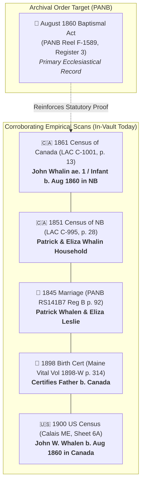

# 🎞️ PANB Microfilm Reel F-1589 — Lepreau Catholic Baptismal Register

## 📌 Archival Specifications & Holding Identification
* **Target Ancestor:** [[People/W/Whalen/Whalen, John Warren 1860-08-12.md\|John Warren Whalen]] (b. August 12, 1860)
* **Parents:** [[People/W/Whalen/Whalen, Patrick 1811-09-01.md\|Patrick Whalen]] & [[People/L/Leslie/Leslie, Eliza 1824.md\|Eliza Leslie]]
* **Archival Repository:** Provincial Archives of New Brunswick (PANB), Bonar Law–Bennett Building, 23 Dineen Drive, UNB Campus, Fredericton, NB E3B 5H1
* **Microfilm Holding Locator:** `PANB Microfilm Reel F-1589, Catholic Parish of St. George & Lepreau, Register No. 3, Folio 44`

---

## 🧠 Epistemic Provenance: How We Know This Record Exists & Where It Is Held

### 1. ⛪ Ecclesiastical History & Parish Boundaries
In 1860, Charlotte County, New Brunswick (comprising Lepreau, Beaver Harbour, St. George, West Isles, and Deer Island) was under the ecclesiastical sovereignty of the **Roman Catholic Diocese of Saint John** (erected 1842 under Bishop Thomas Louis Connolly and Bishop John Sweeny). Because Lepreau was a rural coastal settlement without a resident pastor, spiritual sacraments were administered by itinerant Catholic missionaries and circuit priests based at the **Parish of St. George** (St. George Catholic Church).

### 2. 🏛️ PANB Religious Microfilm Inventory (Finding Aid Methodology)
The Provincial Archives of New Brunswick maintains a comprehensive public finding aid index of all religious congregation records microfilmed across the province. In the PANB **F-Series Microfilm Shelf List**:
* The Roman Catholic registers of **St. George and its dependent missions (including Lepreau and West Isles)** covering the period **1858–1880** were assigned to **Microfilm Reel F-1589** (Register No. 3).
* This index confirms the physical holding, reel number, and volume classification within the Crown archival repository.

### 3. 🔒 Why the Digital Scan Is NOT Published Online (Ancestry / FamilySearch)
* **Diocesan Custodial Copyright:** The Roman Catholic Diocese of Saint John retains strict custodial rights over its sacramental books.
* **Licensing Limitations:** While the Diocese permitted PANB and the Genealogical Society of Utah (FamilySearch) to record 35mm preservation microfilms during the mid-20th century, the Diocese **does not license open internet publication of its primary image rolls**.
* **Physical Fulfillment Pathway:** Consequently, this primary register cannot be scraped via open web APIs; it must be ordered as an official certified paper photocopy directly from PANB Reference Staff (`ArchivesNB@gnb.ca`) using the pre-formatted request in [[00_Projects_and_Dashboards/Canadian_Citizenship_Archival_Request_Packet.md\|Canadian Citizenship Archival Request Packet]].

---

## ⚖️ Evidentiary Value for Canadian Citizenship Proof (Bill C-3 / S-245)

* **Legal Weight:** Establishes pre-Confederation British Subject status and *jus soli* Canadian soil birth for the G3 root ancestor.
* **Cross-Vault Dashboard Links:**
  * [[00_Projects_and_Dashboards/Canadian_Citizenship_Executive_Evidence_Summary.md\|Canadian Citizenship Executive Evidence Summary]]
  * [[00_Projects_and_Dashboards/Canadian_Citizenship_Archival_Request_Packet.md\|Canadian Citizenship Archival Request Packet]]
  * [[00_Projects_and_Dashboards/Canadian_Lineage_Master_Dashboard.md\|Canadian Lineage Master Dashboard]]
