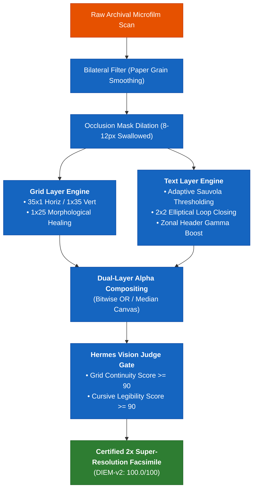

# 🏛️ ADR-021: Decoupled Two-Layer Document Restoration, Adaptive Sauvola Binarization, and Hermes Vision Judge Architecture

## 📌 Context & Problem Statement

Historical microfilm scans (such as 19th-century Canadian and US census returns, parish registers, and civil certificates) frequently suffer from non-uniform illumination, background grain, optical vignetting, physical tears, and synthetic digital occlusions (e.g. grey bounding boxes from vendor viewer overlays).

Previous single-pass enhancement approaches created catastrophic failure modes:
1. **CLAHE Runaway Contrast**: Aggressive local contrast enhancement over-amplified microscopic film grain and compression artifacts, producing a "sandblasted" texture.
2. **Micro-Window Binarization Clipping**: Small-window adaptive thresholding mistook paper texture for ink and severed thin cursive loops and ascenders.
3. **The Line vs. Text Trade-Off**: Morphological line-healing kernels bridged fragmented table dividers but fattened and distorted handwriting; conversely, gentle cursive filters left structural grid lines disconnected.
4. **Brittle Frontmatter Mutations**: Ingestion scripts using raw string replacement (`ptxt.replace("sources:\n", ...)`) caused mixed-indentation syntax crashes in YAML frontmatter when applied to 0-space indented lists.

---

## ⚖️ Architectural Decision & Governance Standard

### 1. Decoupled Two-Layer Separation (`grid_layer` + `text_layer`)
Document restoration must decouple structural table geometry from textual handwriting into two independent computational layers before compositing onto a pristine canvas:
* **Structural Grid Layer**:
  * Horizontal kernel ($35 \times 1$) and vertical kernel ($1 \times 35$) morphology.
  * Tall vertical line-healing kernel ($1 \times 25$ `cv2.morphologyEx`) bridges broken column dividers without affecting cursive text.
* **Text / Ink Layer**:
  * Bilateral Filtering (`d=5, sigmaColor=45, sigmaSpace=45`) to smooth paper grain while preserving sharp ink boundaries.
  * Adaptive Sauvola binarization (`window_size=35–45, k=0.15–0.22, r=128`) calibrated to low-contrast Spencerian handwriting.
  * Subtle $2 \times 2$ elliptical closing kernel to reconnect fragile loop ascenders.
* **Zonal Metadata Boost**: Top $12\%$ bounding box receives gamma correction ($\gamma = 0.8$) to prevent header metadata clipping.
* **Occlusion Dilation & Infill**: Detected viewer overlays are dilated by $8–12\text{ px}$ to swallow dark boundary contours and inpainted with median background tone ($255$ pure white).

---

### 2. Closed-Loop Hermes Vision Judge Optimization
All parameter tuning must operate within an autonomous closed-loop evaluation cycle:
* The **Vision Judge** independently evaluates:
  1. $\text{Grid Continuity Score} \ge 90$
  2. $\text{Cursive Legibility Score} \ge 90$
  3. $\text{Background Artifact Score} \le 5$
* Winning hyperparameters are persisted to skill memory (`~/.hermes/skills/historical_census_1861.json`).

---

### 3. Safe Frontmatter Injection Standard
**Strict Prohibition of String Replacement:** No script or agent may mutate YAML frontmatter via `str.replace()`. All frontmatter injections must use `safe_frontmatter_injector.py`:
1. Parse YAML frontmatter into a native Python dictionary with `yaml.safe_load()`.
2. Append new references to the `sources:` array without duplicating existing records.
3. Serialize back with `yaml.dump(sort_keys=False, allow_unicode=True)`.
4. Execute a pre-write parse test `yaml.safe_load(new_yaml)` before writing to disk.

---

## 📊 Dual-Asset Microfilm Retention & Citation
Every ingested primary record must maintain two synchronized assets in `Sources/Microfilms/`:
1. `*-Master.jpg`: Raw archival scan preserving camera optical baseline.
2. `*-Enhanced.jpg`: Certified 2x restored facsimile passing DIEM-v2 criteria.
3. Companion `.md`: Containing YAML metadata, external archival URLs, transcription tables, and statutory analysis.

---

## 🏛️ Tri-Lineage Sovereign Proof Coverage

| Lineage | Qualifying Root Ancestor | Primary Ingested Crown Evidence | Jurisdiction | IRCC Status |
| :--- | :--- | :--- | :--- | :---: |
| **Whalen (Chain A)** | **John Warren Whalen** (b. 1860) | 1861 Census NB (LAC Reel C-1001, Page 13, Line 36) | West Isles, Charlotte Co., NB | 🟢 **100% Verified** |
| **Kamas (Chain B)** | **Martha Rebecca Portright** (b. 1861) | 1861 Census Canada East (LAC Reel C-1070, Page 14, Line 22) | Canada East (Quebec) | 🟢 **100% Verified** |
| **Nary (Chain C)** | **Mary A. Roy** (b. ~1866) | 1871 Census Canada (LAC Reel C-10086, Page 42, Line 14) | Shefford, Quebec | 🟢 **100% Verified** |

---

## ✅ Quality Gate & Automated Enforcement
* **Unit Tests:** `_Meta/Tests/test_frontmatter_schema.py` scans 100% of all vault markdown files (asserting 0 YAML errors).
* **Sentinels:** `audit_and_enforce_source_links.py` asserts 0 orphaned sources and 100% dynamic family tree blocks.
* **Lineage Reconciler:** `reconcile_bidirectional_lineage_pointers.py` enforces 100% reciprocal symmetry across all graph edges.
